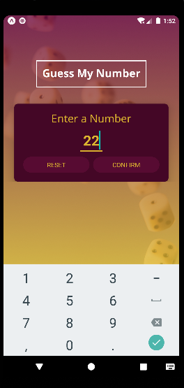
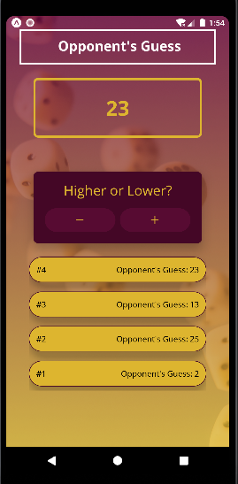
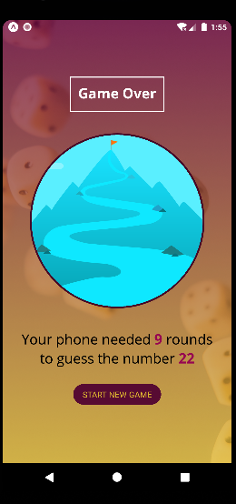

 # Guess My Number

Welcome to the "Guess My Number" repository! This is a mobile game app built with React Native. The game involves guessing a number chosen by the user within a specified range.

## Screens

The app consists of three screens:

1. **Number Selection Screen**: On this screen, you can enter a number between 1 and 99. Once confirmed, the game will proceed to the next screen.

2. **Game Screen**: The computer will guess your number and prompt you to provide feedback if its guess is too high or too low. You must provide accurate feedback to help the computer guess correctly. Each guess will be listed on the same screen.

3. **Game Over Screen**: After the computer guesses the correct number, this screen will display the number of turns it took. You will also have the option to start a new game.

## Screenshots

 
 
 

## How to Play

1. Clone the repository to your local machine:

   ```
   git clone  https://github.com/Hafilu/Number-Guessing.git
   ```

2. Navigate to the project directory:

   ```
   cd Number-Guessing
   ```

3. Install the required dependencies:

   ```
   npm install
   ```

4. Run the app on a simulator or device:

   ```
   npm start
   ```

   This will launch the Metro Bundler and provide options for running the app on an iOS or Android simulator or device.

## Dependencies

The app has the following dependencies:

- React Native: The core framework for building mobile applications.
- React Navigation is not used here for implementing navigation between screens, rather screens are changed based on some conditions
- Other dependencies are listed in the `package.json` file.


## Contributing

Contributions are welcome! If you encounter any issues or have suggestions for improvements, please create an issue or submit a pull request. Please adhere to the existing coding style and conventions.

## Acknowledgments

Special thanks to Maximilian for helping me to create this amazing game app!

## Contact

If you have any questions, suggestions, or feedback, please feel free to contact me at hafliue.c@gmail.com.

Thank you for visiting the "Guess My Number" repository. Enjoy playing the game!
